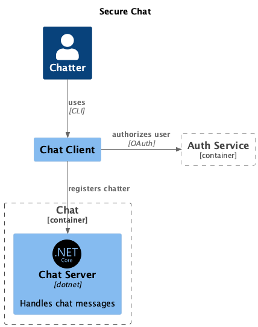

# Secure Software Development Synopsis

## Project scope
This project aims to demonstrate an implementation of two clients, exchanging public keys in order to communicate with each other with encrypted data. In the detailed description there will be an ongoing discussion of why not to implement a feature like that yourself, and suggestions on doing it in another way.
In addition to the encrypted communication, a few initiatives are being demonstrated, to showcase how to take away security management from developers, and using automated tools where possible

## Technical overview

The solution is divided in to 2 main projects:
- A Chat Server that registers users, and offers them to commicate with each other
- A Chat Client, that the real user uses in order to authorize it self, and communicate with another user

To avoid having to deal with user credentials, Auth0 is used to store user credentials. When launching the Chat Client, the client it self initiates an 0Auth session, and the user is presented with a link to Auth0, where a device code has too be used in order to login.
After succesfull login, the Client Connects to the server, to tell it is there.


The login flow is illustrated below

{width=50%}


## Secure communication

When a Client is started from the Command Line, it sets up it "Key manager", which creates a RSA key
```chsarp
 public RsaKeyManager()
    {
        // Generate a new RSA key pair
        _rsaKey = RSA.Create(2048); // 2048-bit key
    }
```


The key manager ensures that we have the counter parts public key, and uses it to create a session key, that the two parts can use to ensure that they are the only ones being able to encrypt and decrypt messages from each other.
The aim is to use asymetric encryption, to initiate symmetric encryption

A quite substansial argument for not writing software like this showed it self in the development. A developer with a skill set limited to the ones of this very author, loses any overview of what is actually encryted, and what are just random bytes showing up in a debugger.


## Security in development


As discussed above, implementing your own encryption should be substituted by using a 3rd party library that abstracts it away, and leaves the common developer with an interface to work with it. 

3rd party software is not without risk, and some safety meassures should be introduced.


If we, for the sake of this discussion, agree on Github as being the defacto place to pull your software from, we can have a look at some of the following indicators:

- Is the software still maintained?
  - When was the last commit?
- Are other people using it?
  - How many times has it been forked?
  - How many stars does it have?
  - How many people are wathcing it?
- Are security concerns being handled?
  - Are security issues being adressed?
  - Are there active discussions?


When having pulled in packages, that might use other packages and so on, it can be difficult for a developer to maintain an overview on what is actually in the sftware we are building.
Software bills of material, or in short SBOM, can help us out.

SBOM's can be generated programmaticly in a standardized format, that allows central monitoring of vulnerable software. 
In 2014 the Heartbleed vulnerabillity showed up in OpenSSL, and within an organisation it would be trivial to find out exactly what software projects made use of OpenSSL, and therefore allowing for a faster mitigation of the vulnerabillity.

Github actions allows for automated SBOM-generation, so that the sole developer only has to deal with develoment.

Speaking of Github actions, it could be used to interpret the output of SBOM, and blacklist packages, for an organisation that doesn't have the infrastructure to whitelist packages

This project used Github actions to automate the build process. A developers laptop can be vulnerable to different sorts of attacks, and those attacks could propagate into the production code, if the software was build on an infected machine.
When a branch is merged to main, Github checks out the code afterwards, and builds the project into a branch called release. The compiled code can either be deployed to somewhere else, or just fetched directly from githubs release branch (don't do that)

When building the software automaticly, then it could just as well be signed, so that when people pull it from Github, despite my warnings, it is at least signed

### Github security

Commits are signed with an SSH key. It could have been PGP, but SSH was chosen
```bash
ssh-keygen -t ed25519 -C "bjoern@goettler.dk" -f ~/.ssh/ssd_examen
cat ~/.ssh/ssd_examen.pub
```

Then the public key was uploaded to github, as a signing key
The local git is configured to use the key
```bash
git config gpg.format ssh
git config user.signingkey ~/.ssh/ssd_examen
```

The recommendation is to add the key to the ssh-agent. Otherwise there can be issues with git accesing the key, and if it is password protected, the password only has to be entered once per session
```bash
eval "$(ssh-agent -s)"
ssh-add ~/.ssh/ssd_examen
```


Now github shows that the committer is verified


The main branch is protected so that it requires a pull request in order to merge to it.
Pull Requests have to be approved by 2 people before they can be completed. 
As an exception the [CODEOWNER](CODEOWNERS) can bypass the rule, so that we can actually do this project